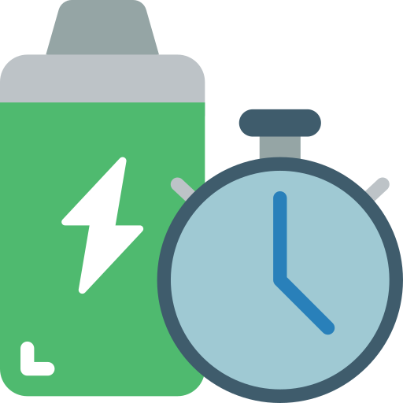

<p align="center">
  
</p>

<h1 align="center">BatteryAgent</h1>

<p align="center">
  macOS 메뉴바 배터리 충전 제한 관리 앱
</p>

<p align="center">
  
  
  
</p>

---

## 주요 기능

- **충전 제한 관리** — 사용자 설정 %까지만 충전, 이후 SMC로 충전 차단
- **스마트 충전** — 사용 패턴 학습(14일) 기반 예측 충전, 캘린더 연동, 수동 규칙
- **메뉴바 전용** — Dock 아이콘 없이 메뉴바에서 즉시 제어
- **배터리 건강 분석** — AI 기반 배터리 상태 분석 및 수명 예측
- **충전 이력** — SQLite 기반 충전/방전 기록 및 차트

## 스크린샷

| 메뉴바 팝오버 | 스마트 충전 설정 |
|:---:|:---:|
| 배터리 상태, 충전 제한 슬라이더, 활성화 토글 | 패턴 학습, 캘린더 연동, 수동 규칙 관리 |

## 설치

### DMG 다운로드

[Releases](https://github.com/leonardo204/BetteryAgent/releases)에서 최신 DMG를 다운로드하여 Applications 폴더로 드래그합니다.

### 빌드

```bash
# Xcode에서 BatteryAgent scheme으로 빌드
open BatteryAgent.xcodeproj

# 또는 DMG 생성 (Developer ID 서명 + 공증 포함)
bash build_dmg.sh
```

## 요구 사항

- macOS 14.0 (Sonoma) 이상
- Apple Silicon 또는 Intel Mac
- 충전 제어를 위한 관리자 권한 (최초 1회)

## 아키텍처

```
BatteryAgent/
├── App/                  # AppDelegate, 메뉴바 설정
├── Models/               # BatteryState, SmartChargingState, ChargeRule
├── ViewModels/           # BatteryViewModel (상태 관리 중심)
├── Views/
│   ├── PopoverView       # 메뉴바 팝오버
│   └── Settings/         # 설정 탭 (AI, 스마트충전, 일반충전, 이력 등)
├── Services/
│   ├── BatteryMonitor    # IOKit 배터리 상태 읽기
│   ├── SMCClient         # SMC 충전 제어 (소켓 통신)
│   ├── SmartChargeScheduler  # 3계층 충전 스케줄러
│   ├── UsagePatternTracker   # EWMA 패턴 학습
│   └── CalendarMonitor       # EventKit 캘린더 연동
├── Utilities/            # Constants, MenuBarIconProvider
└── Resources/            # Info.plist, Assets

BatteryAgentHelper/       # 권한 헬퍼 데몬 (root, SMC 직접 제어)
Shared/                   # XPC 프로토콜
```

## 스마트 충전

3계층 하이브리드 시스템으로 예측 충전:

| 계층 | 방식 | 우선순위 |
|------|------|----------|
| Layer 3 | 사용자 수동 규칙 | 최우선 |
| Layer 2 | EventKit 캘린더 연동 | 보조 |
| Layer 1 | EWMA 히스토그램 패턴 학습 | 자동 |

- 14일 학습 후 자동 활성화
- 패턴 감지 시 100% 충전 → 이후 정상 제한 복귀
- 7일 x 48슬롯(30분) 히트맵 시각화

## 기술 스택

| 항목 | 기술 |
|------|------|
| UI | SwiftUI |
| 배터리 읽기 | IOKit (IOPSCopyPowerSourcesInfo, AppleSmartBattery) |
| 충전 제어 | SMC (CH0B, CH0C, CH0I 키) |
| 데이터 저장 | SQLite (충전 이력, 패턴 데이터) |
| 캘린더 | EventKit |
| 권한 관리 | Security.framework (AuthorizationExecuteWithPrivileges) |
| 데몬 통신 | Unix Domain Socket |

## 라이선스

MIT License

## 개발

개발 관련 상세 사항은 [CLAUDE.md](CLAUDE.md)를 참조하세요.
